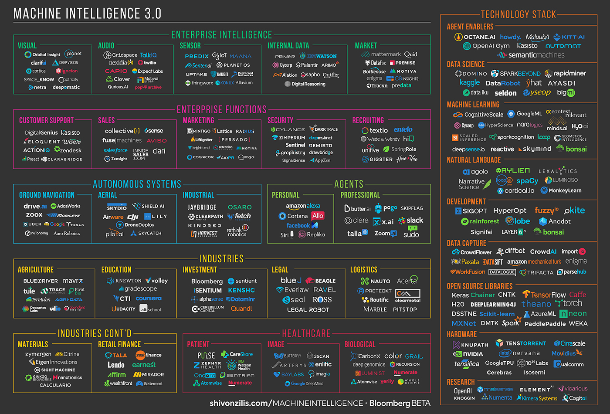

## Introduction

'Predictors' in **machine learning** -- the domain of prediction I will be discussing -- refer to variables or features forming part of a model used in inference or prediction. They are the so-called 'independent variables' in the statistical models that underpin nearly all machine learning.

There is wordplay in the title: 'the predictor' echoes 'the observer', the key figure/term in Jonathan Crary's book, _Techniques of the Observer: On Vision and Modernity in the Nineteenth Century_ [@Crary_1992]. 

> Though obviously one who sees, an observer is more importantly one who sees within a prescribed set of possibilities, one who is embedded in a system of conventions and limitations [@Crary_1992,6].

Crary argues that seeing was transformed in the nineteenth century through the constitution of an observer, someone who sees in particular ways. The constitution of the observer required a set of scientific and cultural practices concerning vision. These practices remake 'the individual as observer into something calculable and regularizable and ... human vision into something measurable and thus exchangeable' (17). In the process, seeing itself was autonomized in apparatuses and devices (stereoscopes, kaleidoscopes, zootropes, etc)   associated with an increasingly disciplined work of vision(19).    

Like Crary, I will suggest that prediction is presently undergoing a transformation,  a transformation that changes both the position of the **predictor** as an individual person and the predictor as data.  Prediction is inseparable from the practices, techniques, institutions and procedures of subjectification. In tandem, prediction, like sight, is being 'autonomized' in  a plurality of ways. 

My general argument here is that the plurality of predictors -- people and variables -- have become much more like a population, the unruly multiplicities that were the conventional target of governmentality [@Foucault_2007]. That is, populations of predictors (people and data) become the general object of regulation as they multiply around predictions.  A particular predictive operation -- **generalization**  -- lies at the centre of this proliferation. 

I'm working with one provisional illustrative example: the 'Passenger Screening Algorithm Challenge -- Improve the Accuracy of the Department of Homeland Security threat recognition algorithms' (https://www.kaggle.com/c/passenger-screening-algorithm-challenge/data), a 'data challenge' currently running on the data science/machine learning competition site/platform, Kaggle.com:      

> Currently, TSA [U.S. Transportation Security Administration] purchases updated algorithms exclusively from the manufacturers of the scanning equipment used. These algorithms are proprietary, expensive, and often released in long cycles. In this competition, TSA is stepping outside their established procurement process and is challenging the broader data science community to help improve the accuracy of their threat prediction algorithms. Using a dataset of images collected on the latest generation of scanners, participants are challenged to identify the presence of simulated threats under a variety of object types, clothing types, and body types. Even a modest decrease in false alarms will help TSA significantly improve the passenger experience while maintaining high levels of security. [Passenger Screening Algorithm Challenge, Kaggle](https://www.kaggle.com/c/passenger-screening-algorithm-challenge)

The predictions that might be made about 'threats' would affect passengers lives quite directly, mostly in the form of the length of time, and associated anxieties, of queuing at airport security in the USA. Not exactly a policy problem, it definitely concerns governmentality and populations.   

## The goverance of prediction: restrict to specificity

The starting point of recent attempts to govern machine learning is **specificity**. The recent Royal Society Report on  machine learning bears the title _Machine learning: the power and promise of computers that learn by example_ [@RoyalSociety_2017]. The section on governance of machine learning is rather brief, although that can be explained in part by the existence of another recent wide-ranging Royal Society report on data governance [@RoyalSociety_2016]. The Royal Society report makes many recommendations concerning the development of machine learning for industrial, research and societal purposes.

Some parts of the report that describe the development of policies for the governance of machine learning. Recommendations for the governance of machine learning begin with a restriction premised on specificity:

> It is not appropriate to set up governance structures for machine learning per se. While there may be specific questions about the use of machine learning in specific circumstances, these should be handled in a sector-specific way, rather than via an overarching framework for all uses of machine learning; some sectors may have existing regulatory mechanisms that can manage, while in others there may not be these existing systems [@RoyalSociety_2017,12]. 

On the one hand, this recommendation acknowledges the generalization of machine learning to many sectors. On the other hand, it insists on specificities of questions, circumstances and sector in opposing any general regulation of machine learning practice. Is the restriction to sector-specific governance viable?  The simplest possibility: what if there is a tension, even a contradiction,  between the proliferation (generalization) of machine learning and its specificities? 

The tension between the generalization of machine learning and the regulatory effort to attend to specificities takes two forms. The organisation of data in machine learning does not respect the boundaries of sectors, and nor does the automation of model-building -- the 'learning' in machine learning -- respect the economic subdivision of predictive labour. Predictors -- in both senses of the term -- multiply and migrate in machine learning. 

## The population of predictors

Prediction, at least in the form of machine learning, becomes an object in the context of technological platforms and their complex populations of actors. It is very difficult to understand the growth of  machine learning practice apart from platforms.  Platforms and their platformization [@Langley_2016; @Helmond_2015] are significant sites of predictive proliferation. Not only do they constitute sites of re-configured interaction of populations, ways of ordering the pluralities of communication and interaction, they pose ordering challenges that lead to a proliferation of predictions as part of a control strategy. It makes sense to think of platforms as a key site in transformation of prediction, and hence in the fabric of predictive governmentality. 

It follows from the logic of platforms that prediction is increasingly autonomised and generalized. Prediction is operationalized in ways that are closely linked to the growth of technological platforms such as social media, large-scale scientific instruments and device-networks. When I first started studying machine learning practice around 2010, machine learning models were still crafted by hand in important ways. That has shifted significantly in the platformization of machine learning itself (in machine learning as as service or infrastructure; e.g. `Google ML Engine` or [`Amazon Machine Learning`](https://aws.amazon.com/machine-learning/)).  Predictive platforms and the predictive elements of existing platforms abound, and their abundance, their unruly multiplicity, perhaps becomes the target of governance. 

What is a predictor in the data? There is a both a simple and a complex answer to this question. The simple version says that the predictors in machine learning take the form of numbers and people. Predictors in the sense of numbers or data are relatively easy to imagine. A typical machine learner work with data arrayed in rows ('observations'; not the link to Crary's 'observer') and columns ('predictors,' also known as 'features' or 'variables.') Machine learners normally designate one column of the data table as the 'response' or 'dependent' variable. 

The more complex answer to the question is that machine learners don't know in advance what a predictor will be. (This is one definition of 'complex': we don't know in advance how many actors will be involved; see [@Latour_1993]).  In the sample data for the DHS  challenge, the predictors exist in potentially huge numbers. The data comes from High-Definition Millimeter Wave Scanners used to scan passengers at airports for threats. The data is a 3D image of a body, divided into zones, with each zone labelled according to the presence or absence of a 'threat' (gun, knife, explosive, etc).    


It is difficult to concisely illustrate the data produced by the scanners. It is highly complicated as a data form, but will in the predictive practice be reduced to a set of predictors.   The final output of the model, in whatever form it takes will be something like this:

|Threat zone|Threat probability|
|--------------------------------------|---|
|1cb13f156bd436222447dd658180bd96_Zone1|0.4|
|1cb13f156bd436222447dd658180bd96_Zone2|0.9|
|1cb13f156bd436222447dd658180bd96_Zone3|0.0|
|1cb13f156bd436222447dd658180bd96_Zone4|0.0|
|1cb13f156bd436222447dd658180bd96_Zone5|0.0|
|1cb13f156bd436222447dd658180bd96_Zone6|0.3|
|1cb13f156bd436222447dd658180bd96_Zone7|0.8|
|1cb13f156bd436222447dd658180bd96_Zone8|0.0|
|1cb13f156bd436222447dd658180bd96_Zone9|0.0|
|1cb13f156bd436222447dd658180bd96_Zone10|0.1|
|1cb13f156bd436222447dd658180bd96_Zone11|0.1|
|1cb13f156bd436222447dd658180bd96_Zone12|0.5|
|1cb13f156bd436222447dd658180bd96_Zone13|0.0|
|1cb13f156bd436222447dd658180bd96_Zone14|0.0|
|1cb13f156bd436222447dd658180bd96_Zone15|0.0|
|1cb13f156bd436222447dd658180bd96_Zone16|0.2|
|1cb13f156bd436222447dd658180bd96_Zone17|0.8|
|---------------------------------------|---|

In a machine learning model, the body threat zones shown in the Body Zone map are assigned a threat probability between 0 and 1 for each scanned individual. The scanned individual in the sample data has a unique ID, and the 17 threat zones. (It is interesting that the head is not a threat zone the DHS screening.)

The model, whatever shape that it takes, has the task of making 16 individual scans of a body taken at 22.5 degree angles part of a whole and assigning threat probabilities to each of the body zones 1-17.  The 16 images of each individual somehow contain the predictors or features on which the model will work, but how these predictors will be extracted, generated or constructed from the images and other data (for instance, the hundred or so metadata fields concerning the scanner itself) cannot be known in advanced of an actual model. 

```
    h['frequency'] = np.fromfile(fid, dtype = np.float32, count = 1)
    h['mat_velocity'] = np.fromfile(fid, dtype = np.float32, count = 1)
    h['num_pts'] = np.fromfile(fid, dtype = np.int32, count = 1)
    h['num_polarization_channels'] = np.fromfile(fid, dtype = np.int16, count = 1)
    h['adc_min_voltage'] = np.fromfile(fid, dtype = np.float32, count = 1)
    h['adc_max_voltage'] = np.fromfile(fid, dtype = np.float32, count = 1)
    h['band_width'] = np.fromfile(fid, dtype = np.float32, count = 1)
    h['spare01'] = np.fromfile(fid, dtype = np.int16, count = 5)
    h['polarization_type'] = np.fromfile(fid, dtype = np.int16, count = 4)
    h['record_header_size'] = np.fromfile(fid, dtype = np.int16, count = 1)
    h['word_type'] = np.fromfile(fid, dtype = np.int16, count = 1)
    ... 
    h['spare06'] = np.fromfile(fid, dtype = np.int16, count = 1)
    h['scanner_radius'] = np.fromfile(fid, dtype = np.float32, count = 1)
    h['x_offset'] = np.fromfile(fid, dtype = np.float32, count = 1)
    h['y_offset'] = np.fromfile(fid, dtype = np.float32, count = 1)
    h['z_offset'] = np.fromfile(fid, dtype = np.float32, count = 1)
    h['t_delay'] = np.fromfile(fid, dtype = np.float32, count = 1)
    h['range_gate_start'] = np.fromfile(fid, dtype = np.float32, count = 1)
    h['range_gate_end'] = np.fromfile(fid, dtype = np.float32, count = 1)
    h['ahis_software_version'] = np.fromfile(fid, dtype = np.float32, count = 1)
``` 

The code extract from one contestant's work on preparing the scanner data for modelling lists many different elements of the scanner itself that might be relevant to the final predictions: the 'software version', the   'azimuth offset angle,' etc.  The point here is that the number of predictors that might figure in the threat prediction algorithm is a matter of exploration, discovery and invention. The machine learning literature [@Hastie_2008] is replete with techniques of constructing, eliciting, finding or creating additional predictors in a bid to improve the accuracy of prediction. Indeed the very form of the data challenge or Kaggle  machine learning competition plays on that double sense of predictor: by enrolling large numbers of people in predictive work -- typical Kaggle competitions have several thousand entrants -- the 'Passenger Threat Screening' competition multiplies predictors in both senses of the term. More people or even a 'crowd' or undisciplined population constructing models will lead to the deployment of more predictors in the models. 

The data analytic tools that machine learners use to work with such data are very widely available. In the case of the data science competitions on Kaggle.com, they are usually Python or R libraries. Indeed, the use of widely available, normally open-source software libraries to implement  machine learning models is very much a defining feature of the shift in 'techniques of the predictor' I am describing here.  Indeed, the DHS describes the aim of the challenge in precisely these terms:  advancing the accuracy of threat detection by changing models more rapidly and escaping the slow pace of proprietary software development. The prize money on offer -- \$USD1.5 million -- attests to value of such acceleration. 

## Multiplication of prediction: generalization



The second  main implication I want to develop here concerns the ways in which prediction itself multiplies in and through machine learning. This multiplication affects how machine learning has recently become an object of regulation or governmentality since the proliferation of prediction and its autonomisation (self-driving cars, AI, etc.) seems to pose 'existential threats' [@Gibbs_2017]. The growing governmentality of prediction does not stand apart from prediction itself, but is part of the constitution of the predictor.[^1] 

I will focus on perhaps the simplest and most general claim characterising the emerging regimes of prediction associated with machine learning: generalization. Let me begin by pointing to the  spread or generalization of the practice. The techniques and models grouped under machine learning come from diverse scientific and engineering fields. They include statistics, computer science, operations research, control theory and various specific fields such as psychology and even sociology. The techniques and practices vary in age, some dating from the 19th century and others from the last few years. 

[^1]: I appreciate that this runs in the opposite direction to the theme of the conference ('how prediction impinges on policy'). By examining how prediction becomes a topic of governmentality, we might also learn something about the way that prediction feeds into policy. 

Machine learning presents a challenge to our analytical imperatives to deal with specificity and singularity in case studies. I have argued elsewhere [@Mackenzie_2017] that the specificity of  machine learning resides in its generalization, its tendency to vectorize, functionalise and probabilise situations within certain operational formations. The apparatus of generalization is perhaps the only way to explain its extraordinary proliferation across sectors of sciences, biomedicine, industries, media and government in the last decades. Of course, it is possible to choose any number of case studies of machine learning predictions operating in specific locations, but perhaps the most high profile would be social media and internet platforms such as Facebook and Google, where a myriad of machine learners can be found.

*Generalization* has a specific technical sense in machine learning practice. It refers to the capacity of a machine learner (again, like predictor, the term 'machine learner' includes both people and things) to accurately predict or classify when confronted with new data or 'observations.' The capacity of machine learning to generalize or to learn from examples has often been discussed, and is a regular feature of accounts of machine learning, including those focused on its governance:

> Machine learning can carry out tasks of such complexity that the desired outputs could not be specified in programs based on step-by-step processes created by humans [@RoyalSociety_2017,19]. 

Characteristically, the capacity of these techniques to predict is equated  to their capacity to generalize from known examples (training data) to fresh or hitherto unseen examples (test data). And this capacity to generalize, and hence their predictive power, depends on the models ability to 'carry out tasks of such complexity' that programs to do them could not be specified step-by-step by human programmers, statisticians or engineers. (As we will see, this 'inhuman' capacity also creates the governance problems -- the 'existential threat' --  and need for regulatory policy around machine learners.)    

## The observation of generalization

A preliminary observation here is that we are not dealing with isolated, epistemically concentrated devices, but populations of predictors that form part of *platforms.* This aspect of machine learning is often neglected in the policy discussions. Machine learning nearly always takes place in situations where the complexity of the situation cannot be specified in programs of action. The 'tasks of such complexity' that the Royal Society report mentions arise in the hyper-complex environments associated with media, biomedicine, security, urban transportation, etc.  (One brief example of this: `FBLearnerFlow` is a  machine learning pipeline developed and used by Facebook to allow predictions and predictive models to proliferate and populate every nook and cranny of the sprawling entanglement of systems it operates. According to its developers, roughly a million models have been developed using `FBLearnerFlow` [@Dunn_2016].) The simple point here is that we are not dealing with a single centre of predictive calculation, but a platformizing process in which predictions increasingly operate as ways of experimenting with, modulating and shaping the sometimes chaotic or unstable dynamics of platforms.  In this, and a myriad of other examples that could be given, prediction, and learning to predict takes place amidst populations of models of varying complexity. In some respects, we could say, machine learning is the practice of disciplining and automating the production of prediction, much as Crary argues that sight was autonomized in visual apparatuses of the 19th century. 

A second observation concern automation or autonomisation in platforms. Machine learners are an integral part of the autonomisation of platforms. We need only thing of self-driving cars or personalized online advertising as rough and ready cases of this autonomisation. But this automation of prediction, its conversion into an operational practice, does not occur automatically. It arises from careful observation or the work of predictors. A population of predictive models (focused on  inference, classification, description, experimentation, etc.) is always involved. This population itself  is very much the target of observation, examination, testing and competition. That is, their predictive performance -- their accuracy, their error rates, etc. -- attract very close scrutiny and observation. Indeed, this observation of prediction is perhaps the main concern of  machine learners in practice. Many of the practices that define  machine learning as a set of techniques ranging from the transformation of data into a set of predictors, features or variables in a vector space, implementation of various models and training of their operation through use of various techniques of optimisation, randomisation, probabilisation and competitive testing entail observation and visual ordering.

![The observation of generalization] (figure/generalization-zhang_2017.png)

At the very core of machine learning, the claim to learning rests on a mode of observation of something implicitly opaque. How does a model assimilate the features or predictors of the training data, the data whose significance is known, in  producing predictions with traction on the unknown or hitherto unseen events that might occur? In all their varieties --  neural nets, convolutional neural ents,  support vector machines, linear regressions, decision tree classifiers, random forests, logistic regressions, _k_ nearest neighbours, _k_-means clustering, principal component analysis, linear discriminant analysis, Latent Dirichlet Allocation, etc. --  the measurement of errors, the adjustment of model parameters, the tuning and optimisation of predictions pivots on the _partial_ observation of differences between many versions of the same or related models. The techniques deployed to generate many versions of the same model and to optimise their parameters vary quite widely in their underlying intuitions, but invariably rely on the cybernetic function-finding techniques.  The predictors in  machine learning are always involved in a form of observation or partial observation. Often what is observed is a curve: the curve of a cost or objective function used in optimising the accuracy or error rate of the model.


A preliminary solution to the 'Passenger Screening Algorithm Challenge' uses a now -- since 2012 -- standard approach to working with images, a convolutional neural network. Although the technical details of this architectural diagram, and its implementation in practice are complex, two features stand out in this modelling practice. 

First, the great number of elements in the model amounts to a population of predictors. The numbers in the figure refer to the number of 'neurons' in that layer of the model, and the model has at least nine layers. Given that a 'neuron' or perceptron is already effectively a classifier, this one version of the model already has around 650,000 sub-models, and 60 million parameters [@Krizhevsky_2012,1]. This population or assemblage of elements can only become predictive through _training_, the process of gradually adjusting the millions of parameters in the light of constant observation of error rates.Given that this training is very calculatively intensive, it increasingly takes place on computational platforms (AWS, GoogleCompute, Microsoft Azure, etc.).    

Second, the relations between the many elements (layers, comprising neurons, each with parameters) in the model can only be shaped by subjecting them to regimes of observation. A contestant in the DHS data challenge writes:

> So far I have run training against the first three threat zones (1-3), I am currently seeing validation accuracy in the 92-96% range. ... So while it appears we may be getting some predictive value, much work would be needed to drive those accuracy numbers higher. [Convnet trainer](https://www.kaggle.com/jbfarrar/preprocessing-pipeline-and-convnet-trainer/notebook)  

Even if the contestant is describing preliminary results for a contest that still has many months to run, the focus on 'validation accuracy' or error rates is primary. The architecture of the model (known as `alexnet`) embodies the partial autonomy of observation needed for the training or shaping of the population of elements to take place. On this point, we are back to the situation that Crary's account of 'techniques of the observer' describes: an autonomization of prediction is occurring through a complex re-making of the individual predictor into something calculable and regularizble [@Crary_1992, 17]. 

## Conclusion

Emerging regulatory dilemmas and controversies associated with prediction revolve around the interplay, mutability, proliferation and diversity of predictors, both in the sense of people doing predictive work and the ongoing transformation of all forms of data (images, sounds, measurements, transactions, speech, text, etc.) into predictors. It multiplies predictors in the sense of the group of people or crowds involved in predicting. It multiplies predictors in the sense of subsuming data in and across almost any sector as predictors. The learning in machine learning, I have suggested too, attests not simply to an automation or autonomisation of prediction, but to the gradual accumulation of regimes of observation, examining and testing suited to the comparison of many predictions. Machine learning, I have suggested, has a platform reality. The learning in machine learning, its capacity to deal with complexity, attests to the accumulation of regimes of observation and their partial delegation to non-humans. The capacity of  machine learners to generalize, I have suggested, depends on both a loss of specificity for predictors (hence, machine learners come from many places, and can even be marshalled in crowds, as Kaggle.com does), and a generalization of regimes of prediction (so that the same kinds of models used in fisheries management will appear in passenger threat detection or astronomy). 

What do 'techniques of the predictor' mean for governance of prediction? It might mean re-thinking the premise of restriction to specificity, or the idea that the regulation of machine learning should be sector-specific, to use the language of the Royal Society report. At simplest, what I have described  suggests  that differences between the general and the specific, differences that have been regarded as axiomatic in emerging policies governing machine learning, do not maintain a stable configuration. That is, it may not be possible to hold on to site or sector specificity in thinking about the governance of machine learning-based forms of prediction. The sectors are, it seems, re-defined  by the plurality of predictors and the generalization of prediction.  What does it mean that machine learners in France might be developing the predictive models that change the flow of passengers through security checkpoints at LA or Atlanta airports? 

## References

