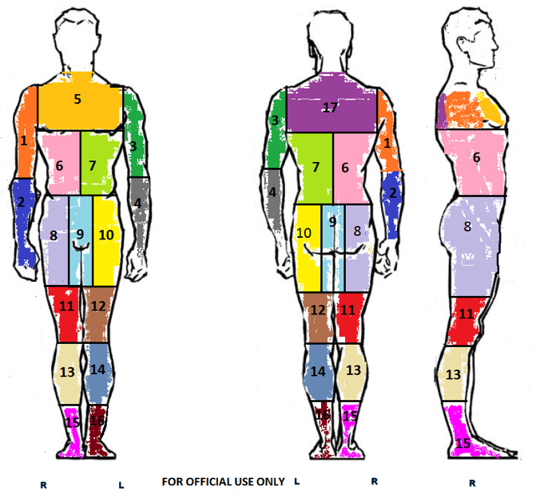

# Techniques of the Predictor: Generalizing to Complex Populations

## Introduction

'Predictors' in machine learning refer to variables or features included in a model used in inference or prediction. Predictors are the so-called 'independent variables' in the statistical models that underpin nearly all machine learning. There is wordplay in my title: 'the predictor' is a play on 'the observer,' the key figure/term in Jonathan Crary's book, _Techniques of the Observer: On Vision and Modernity in the Nineteenth Century_ [@Crary_1991]. 

> Though obviously one who sees, an observer is more importantly one who sees within a prescribed set of possibilities, one who is embedded in a system of conventions and limitations [@Crary_1991,6].

Crary argues that seeing was transformed in the nineteenth century through the constitution of an observer, someone who sees in particular ways. The constitution of the observer required a set of scientific and cultural practices concerning vision. These practices remake 'the individual as observer into something calculable and regularizable and ... human vision into something measurable and thus exchangeable' (17). In the process, seeing itself was autonomized in apparatuses associated with the disciplined work of vision (19).    

Like Crary, I will argue that we see a transformation in prediction occurring,  one in which the position of the **predictor** swaps between people and things. Prediction is inseparable from the practices, techniques, institutions and procedures of subjectification. At the same time, and as a consequence, prediction, like sight, is being 'autonomized,' but in ways that elicit further efforts to govern prediction.    

My general argument here is that the population of predictors -- people and variables -- have become much more like the populations that are the conventional target of governmentality [@Foucault_2007]. That is, populations of predictors (people and data) become the general object of regulation, but in a new form. A particular operation -- **generalizing** -- will be at the centre discussion here. 

I will work with one illustrative example: the 'Passenger Screening Algorithm Challenge -- Improve the Accuracy of the Department of Homeland Security threat recognition algorithms' (https://www.kaggle.com/c/passenger-screening-algorithm-challenge/data), a 'challenge' currently running on the data science/machine learning competition site/platform, Kaggle.com:      

> Currently, TSA [Transportation Security Administration] purchases updated algorithms exclusively from the manufacturers of the scanning equipment used. These algorithms are proprietary, expensive, and often released in long cycles. In this competition, TSA is stepping outside their established procurement process and is challenging the broader data science community to help improve the accuracy of their threat prediction algorithms. Using a dataset of images collected on the latest generation of scanners, participants are challenged to identify the presence of simulated threats under a variety of object types, clothing types, and body types. Even a modest decrease in false alarms will help TSA significantly improve the passenger experience while maintaining high levels of security. [Passenger Screening Algorithm Challenge, Kaggle](https://www.kaggle.com/c/passenger-screening-algorithm-challenge)

The predictions that might be made about 'threats' would affect passengers lives quite directly, mostly in the form of the length of time, and associated anxieties, of queuing at airport security in the USA. 

## The observers of prediction

The recent Royal Society Report on  machine learning bears the title _Machine learning: the power and promise of computers that learn by example_ [@RoyalSociety_2017]. The section on governance of machine learning is rather brief, although that can be explained in part by the existence of another recent wide-ranging Royal Society report on data governance [@RoyalSociety_2016]. The machine learning report makes many recommendations concerning the development of machine learning for industrial, research and societal purposes. I'm interested, however, in the parts of the report that describe the development of policies for the governance of machine learning. 

Recommendations for the governance of machine learning begin from a premise of specificity:

> It is not appropriate to set up governance structures for machine learning per se. While there may be specific questions about the use of machine learning in specific circumstances, these should be handled in a sector-specific way, rather than via an overarching framework for all uses of machine learning; some sectors may have existing regulatory mechanisms that can manage, while in others there may not be these existing systems [@RoyalSociety_2017,12]. 

On the one hand, this recommendation appears to acknowledge the generalization of machine learning to many sectors. On the other hand, it insists on specificities of questions, circumstances and sector in opposing any general regulation of its practice.  The simplest possible question here: is there a tension between the generalization of machine learning and the need to attend to its specificities? In the light of the mundane realities of machine learning as predictive practice, I would provisionally 'yes.'  

## The position of the predictors

Prediction, at least in the form of machine learning, becomes an object in the context of technological platforms and their complex populations of actors. It is very difficult to understand the growth of  machine learning practice apart from platforms.  Platforms and their platformization [@TBA - Paul Edwards article] are significant sites of predictive proliferation. Not only do they constitute sites of re-configured interaction of populations, ways of ordering the pluralities of communication and interaction, they pose ordering challenges that lead to a proliferation of predictions as part of a control strategy. It makes sense to think of platforms as a key site in transformation of prediction, and hence in the fabric of predictive governmentality. 

It follows from the logic of platforms that prediction is increasingly autonomised. Prediction is increasingly operationalized in ways that are closely linked to the growth of technological platforms such as social media, large-scale scientific instruments and device-networks. When I first started studying machine learning practice around 2010, machine learning models were still crafted by hand in important ways. That has shifted significantly in the platformization of machine learning itself. Now predictive platforms and the predictive elements of existing platforms abound, and their abundance, their unruly multiplicity, perhaps becomes the target of governance. [TBA - examples of machine learning platforms].    

What is a predictor in the data? There is a both a simple and a complex answer to this question. The simple version says that the predictors in machine learning take the form of numbers and people. Predictors in the sense of numbers or data are relatively easy to imagine. A typical machine learner work with data arrayed in rows ('observations'; not the link to Crary's 'observer') and columns ('predictors,' also known as 'features' or 'variables.') Machine learners normally designate one column of the data table as the 'response' or 'dependent' variable. 

The more complex answer to the question is that machine learners don't know in advance what a predictor will be. (This is one definition of 'complex': we don't know in advance how many actors will be involved; see [@Latour_1993]).  In the sample data for the DHS  challenge, the predictors exist in potentially huge numbers. The data comes from High-Definition Millimeter Wave Scanners used to scan passengers at airports for threats. The data is a 3D image of a body, divided into zones, with each zone labelled according to the presence or absence of a 'threat' (gun, knife, explosive, etc).    

It is difficult to concisely illustrate the data produced by the scanners. It is highly complicated as a data form, but will in the predictive practice be reduced to a set of predictors.   The final output of the model, in whatever form it takes will be something like this:

|Threat zone|Threat probability|
|--------------------------------------|---|
|1cb13f156bd436222447dd658180bd96_Zone1|0.4|
|1cb13f156bd436222447dd658180bd96_Zone2|0.9|
|1cb13f156bd436222447dd658180bd96_Zone3|0.0|
|1cb13f156bd436222447dd658180bd96_Zone4|0.0|
|1cb13f156bd436222447dd658180bd96_Zone5|0.0|
|1cb13f156bd436222447dd658180bd96_Zone6|0.3|
|1cb13f156bd436222447dd658180bd96_Zone7|0.8|
|1cb13f156bd436222447dd658180bd96_Zone8|0.0|
|1cb13f156bd436222447dd658180bd96_Zone9|0.0|
|1cb13f156bd436222447dd658180bd96_Zone10|0.1|
|1cb13f156bd436222447dd658180bd96_Zone11|0.1|
|1cb13f156bd436222447dd658180bd96_Zone12|0.5|
|1cb13f156bd436222447dd658180bd96_Zone13|0.0|
|1cb13f156bd436222447dd658180bd96_Zone14|0.0|
|1cb13f156bd436222447dd658180bd96_Zone15|0.0|
|1cb13f156bd436222447dd658180bd96_Zone16|0.2|
|1cb13f156bd436222447dd658180bd96_Zone17|0.8|
|--------------------------------------|---|

In a machine learning model, the body threat zones shown in the Body Zone map are assigned a threat probability between 0 and 1 for each scanned individual. The scanned individual in the sample data has a unique ID, and the 17 threat zones. (It is interesting that the head is not a threat zone the DHS screening.)

The model, whatever shape that it takes, has the task for taking 16 individual scans of a body taken at 22.5 degree angles part of the whole and assigning threat probabilities to the body zones 1-17.  The 16 images of each individual somehow contain the predictors or features on which the model will work, but how these predictors will be extracted, generated or constructed from the images and other data (for instance, the hundred or so metadata fields concerning the scanner itself) cannot be known in advanced of an actual model. 

The data analytic tools that machine learners use to work with such data are very widely available. In the case of the data science competitions on Kaggle.com, they are usually Python or R libraries. Indeed, the use of widely available, normally open-source software libraries to implement  machine learning models is very much a defining feature of the shift in 'techniques of the predictor' I am describing here.  Indeed, the DHS describes the motivation for the challenge in precisely these terms: the advance the accuracy of threat detection by changing models more rapidly and escaping the slow pace of proprietary software development. The prize money on offer -- \$USD1.5 million -- attests to value of such acceleration. 

## The main implication

The main implication I want to develop here concerns the ways in which prediction has recently become an object of regulation or governmentality in its own right. The growing governmentality of prediction does not stand apart from prediction itself, but is part of the constitution of the predictor.[^1] 

Obviously the governance of machine learning is potentially a huge topic. I will focus on perhaps the simplest and most general claim characterising the emerging regimes of governance: generalization. 

[^1]: I appreciate that this runs in the opposite direction to the theme of the conference ('how prediction impinges on policy'). By examining how prediction becomes a topic of governmentality, we might also learn something about the way that prediction feeds into policy. 

## The proliferation of prediction: a generalizing apparatus

Let me begin by pointing to the  spread of the practice of prediction known as machine learning. The techniques and models grouped under machine learning come from diverse scientific and engineering fields. They include statistics, computer science, operations research, control theory and various specific fields such as psychology and even sociology. The techniques and practices vary in age, some dating from the 19th century and others from the last few years. 

Machine learning presents a challenge to our analytical imperatives to deal with specificity and singularity in case studies. I have argued elsewhere [@Mackenzie_2017] that the specificity of  machine learning resides in its generalization, its tendency to vectorize, functionalise and probabilise situations within operational formations. The apparatus of generalization is perhaps the only way to explain its extraordinary proliferation across sciences, biomedicine, industries, media and government in the last decades. Of course, it is possible to choose any number of case studies of machine learning predictions operating in specific locations, but perhaps the most high profile would be social media and internet platforms such as Facebook and Google, where a myriad of machine learners can be found.

- *Generalization* also has a specific technical sense in machine learning practice. It refers to the capacity of a machine learner (again, like predictor, the term machine learner includes both people and things) to accurately predict or classify when confronted with new data or 'observations.' 
- The capacity of machine learning to generalize or to learn from examples has often been discussed, and is a regular feature of accounts of machine learning:

> Machine learning can carry out tasks of such complexity that the desired outputs could not be specified in programs based on step-by-step processes created by humans [@RoyalSociety_2017,19]. 

Characteristically, the capacity of these techniques to predict is inseparable from their capacity to generalize from known examples to fresh or hitherto unseen examples. And this capacity to generalize, and hence their predictive power,  depends on the models ability to 'carry out tasks of such complexity' that programs to do them could not be specified step-by-step by human programmers, statisticians or engineers. (As we will see, this inhuman capacity also creates the governance problems and need for policy around machine learners.)    

## The possibilities and impossibilities of generalizing

The preliminary observation here is that we are not dealing with isolated, epistemically concentrated forms of prediction, but populations of predictors that respond to the exigencies of *platforms.* This aspect of machine learning is often neglected in the policy discussions. Machine learning nearly always takes place in situations where the complexity of the situation cannot be specified in programs of action. 

One brief example of this: `FBLearnerFlow` is a  machine learning pipeline developed and used by Facebook to allow predictions and predictive models to proliferate and populate every nook and cranny of the sprawling entanglement of systems it operates. According to its developers, roughly a million models have been developed using `FBLearnerFlow`. The simple point here is that we are not dealing with a single centre of predictive calculation, but a platformizing process in which predictions increasingly operate as ways of experimenting with, modulating and shaping the sometimes chaotic or unstable dynamics of social media platforms.  

- In this, and a myriad of other examples that could be given, prediction, and learning to predict takes place amidst populations of models of varying complexity. In some respects, we could say, machine learning is the practice of disciplining and automating the production of prediction, much as Crary argues that sight was autonomized in visual apparatuses of the 19th century. 

-  This population of predictive models (involved in inference, classification, description, experimentation, etc.), is very much the target of observation. That is, their predictive performance -- their accuracy, their error rates, etc. -- attract very close scrutiny and observation. Indeed, this observation of prediction is perhaps the main concern of  machine learners in practice. Many of the practices that define  machine learning as a set of techniques ranging from the transformation of data into a set of predictors, features or variables in a vector space, implementation of various models and training of their operation through use of various techniques of optimisation, randomisation, probabilisation and competitive testing entail observation and visual ordering.
- the link between prediction & vision: Crary's main argument about vision
- the form of observation that we see in machine learning can be understood as a 'partial observer of the function' in Deleuze and Guattari's terms.
-

## The observation of predictions

## References

