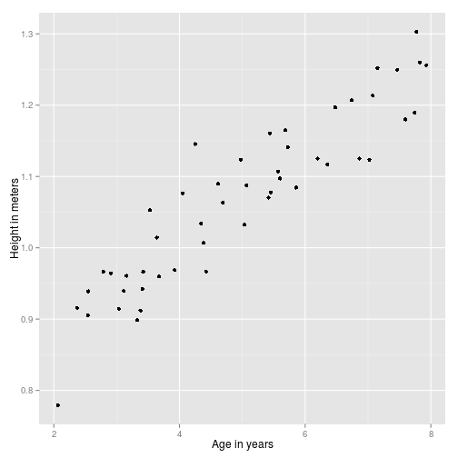
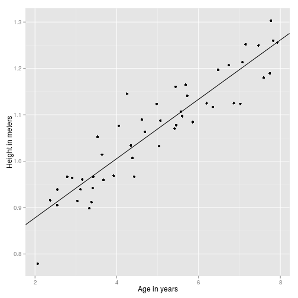

# technique demos

## gradient descent 

Lesson 2 of Ng; implemented in R [here](http://al3xandr3.github.com/2011/02/24/ml-ex2-linear-regression.html)

Also, useful for demonstration of matrix algebra.

### Theory

The model we will get at the end is a line that fits the data, is defined like
so: 

Setting $x_0 = 1$: 


  $$h_\theta(x) = \theta_0 x_0 + \theta_1 x_1 + \theta_2 x_2 + ...$$

That can be summarized by (last is matrix notation): 


  $$h_\theta(x) = \sum_{i=0}^n \theta_i x_i = \theta^T x$$


Matrix representation is useful because has good support in software tools. 

Goal is to get the line closest to observed data points as possible, thus we
can define a cost function that returns the difference of the real data vs
myModel: 


$$J(\theta) = \frac{1}{2m} \sum_{i=1}^m (h_\theta(x^{(i)}) - y^{(i)})^2$$


where $i$ is each data example we have and m is their total. 

With $J$ we now have a metric to check if the hypotheses line is getting closer
to data points or not. 

Next step is to find the smaller cost as possible from $J$, and in fact that's
exactly what the [gradient descent algorithm](http://mathworld.wolfram.com/MethodofSteepestDescent.html)  does: starting with an initial guess it iterates to smaller and smaller values of a given function by
following the [direction of the derivative](http://www.wolframalpha.com/input/?i=Plot[{x^2,+2+x},+{x,+0,+2.2}]): 


$$x_i := x_{i-1} - \epsilon f'(x_{i-1})$$


Applying to our $J$: 


$$\theta_j := \theta_j - \alpha \frac{\delta}{\delta \theta_j} J(\theta)$$

And doing a bit of calculus on derivatives we get: 

$$\theta_j := \theta_j - \alpha \frac{1}{m} \sum_{i=1}^m (h_\theta(x^{(i)}) - y^{(i)}) x^{(i)}$$


Where $\alpha$ defines the size of steps of the convergence to $\theta$. Now lets check if all this math really works. 


 


### Implementation - take 1

$\alpha$ is the size of the step taken each iteration


```r
alpha = 0.07
m = length(mydata$x)
theta = c(0, 0)
x = mydata$x
y = mydata$y
delta = function(x, y, th, m) {
    sum = 0
    for (i in 1:m) {
        sum = sum + (((t(th) %*% c(1, x[i])) - y[i]) * c(1, x[i]))
    }
    return(sum)
}

# 1 iteration
theta - alpha * 1/m * delta(x, y, theta, m)
```

```
[1] 0.07453 0.38002
```


### Implementation - take 2

 After having a peek at the [Matlab solution](http://openclassroom.stanford.edu/MainFolder/courses/MachineLearning/exercises/ex2materials/ex2.m), I learned that is possible to
replace the sum in the equation with a transpose matrix multiplication(like
done with the line equation): 


$$\theta := \theta - \alpha \frac{1}{m} x^T (x\theta^T - y)$$

So we can get a full matrix implementation: 


```r

alpha = 0.07
m = length(mydata$x)
theta = matrix(c(0, 0), nrow = 1)
x = matrix(c(rep(1, m), mydata$x), ncol = 2)
y = matrix(mydata$y, ncol = 1)
delta = function(x, y, th) {
    delta = (t(x) %*% ((x %*% t(th)) - y))
    return(t(delta))
}

# 1 iteration
theta - alpha * 1/m * delta(x, y, theta)
```

```
        [,1] [,2]
[1,] 0.07453 0.38
```

```r

for (i in 1:1500) {
    theta = theta - alpha * 1/m * delta(x, y, theta)
}
theta
```

```
       [,1]    [,2]
[1,] 0.7502 0.06388
```

```r

ex2plot + geom_abline(intercept = theta[1], slope = theta[2])
```

 


